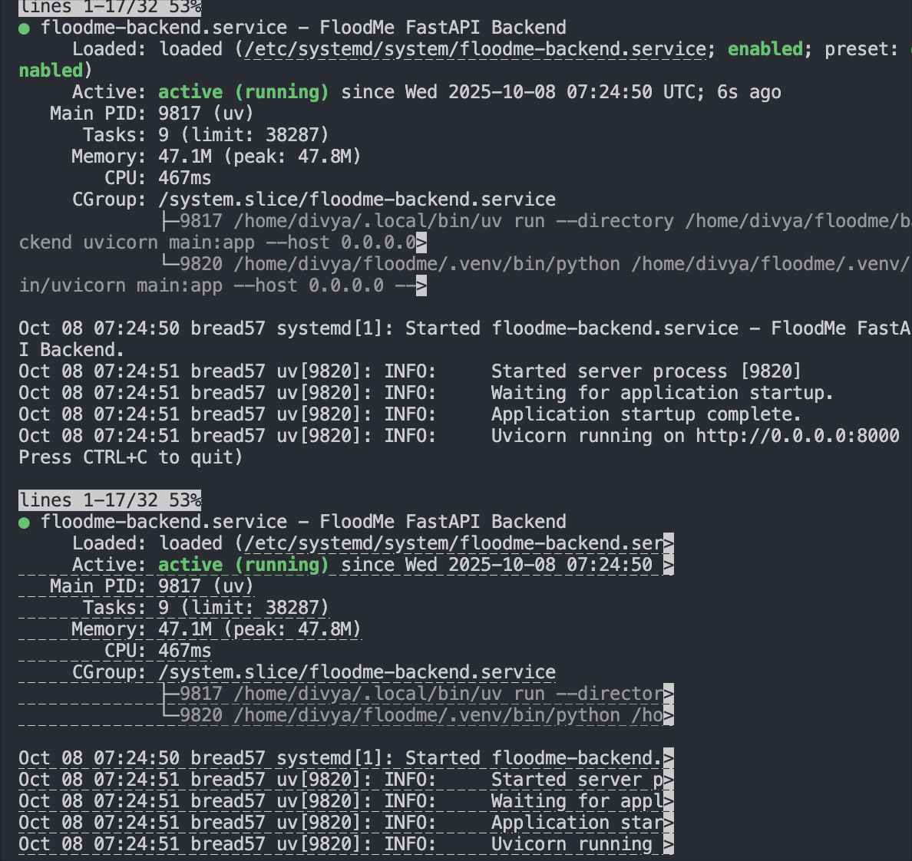

# SSH-ing into server 
1) If you're not at Bread HQ, SSH into the local server (Bread49)

`ssh divya@ai.language.ltd`

2) SSH into the actual server machine (Bread57). Use your admin account

`ssh divya@192.168.8.57`

# Initial setup on new serer

3) If the repo does not exist on the machine, pull it 
`git clone https://github.com/Bread-Technologies/floodme.git`
`git config --global user.email "server@bread.com"`
`git config --global user.name "Bread Server"`

4) Enter repo
`cd floodme`


5) Install the backend dependencies. Create an environment file in the backend folder. Press i to edit the document and fill in information. Press escape and :wq to save. 

`cd backend`
`uv sync`
`cp .env.example .env.production && vim .env.production`

Create an environment file in the backend folder. Press i to edit the document and fill in information. Press escape and :wq to save. 

`cd ../frontend`
`npm install`
`npm run build`
`cp .env.example .env.production && vim .env.production`

6) Create a file to configure the systemd backend service. This will set up a persistent backend process on port 8000 and starts on its own again if the computer reboots or something. 

`sudo vim /etc/systemd/system/floodme-backend.service`

Type in admin password. 

Press i and copy paste this into vim. Press escape and :wq to save.

```
[Unit]
  Description=FloodMe FastAPI Backend
  After=network-online.target
  Wants=network-online.target

[Service]
  User=divya
  WorkingDirectory=/home/divya/floodme/backend
  EnvironmentFile=/home/divya/floodme/backend/.env
  # explicitly include user's local bin so uv is found
  Environment="PATH=/home/divya/.local/bin:/usr/bin:/bin"
  # run using uv so it sets up its environment
  ExecStart=/home/divya/.local/bin/uv run --directory /home/divya/floodme/backend     uvicorn main:app --host 0.0.0.0 --port 8000
  Restart=on-failure
  RestartSec=3
  # optional but good practice
  StandardOutput=journal
  StandardError=journal

  [Install]
  WantedBy=multi-user.target

```

7) Create a file to configure the systemd frontend service. This will set up a persistent backend process on port 3000 and start on its own again if the computer reboots or something. 

`sudo vim /etc/systemd/system/floodme-frontend.service`

Type in admin password. 

Press i and copy paste this into vim. Press escape and :wq to save.

```
  [Unit]
  Description=FloodMe Frontend
  After=network.target

  [Service]
  User=divya
  WorkingDirectory=/home/divya/floodme/frontend
  ExecStart=/usr/bin/npx serve -s dist -l 3000
  Restart=always

  [Install]
  WantedBy=multi-user.target

  ```

Run the following commands. Apparently this is what they do:
    - daemon-reload: Reloads systemd to recognize new service files
    - enable: Makes services start automatically on boot
    - start: Starts the services
    - status: Checks if services are running

  `sudo systemctl daemon-reload`

  `sudo systemctl enable floodme-backend floodme-frontend`

  `sudo systemctl start floodme-backend floodme-frontend`

  `sudo systemctl status floodme-backend floodme-frontend`

  You should see both services running like this. You won't go back to the CLI automatically; press `q` to quite the status view.



8) Make the redeploy script executable

`chmod +x ../redeploy.sh`


# Pushing Updates and Redeploying

## From Dev Machine

1) Push your code changes to main

  `git push origin main`

## On Server

2) SSH into the server (if not at Bread HQ, SSH into Bread49 first, then Bread57)

  `ssh divya@192.168.8.57`

3) Navigate to the floodme directory

  `cd floodme`

4) Run the redeploy script to pull updates and restart services. The user info will update from the dev server while other data gets pushed. 

  `./redeploy.sh`

6) Verify services are running

  `sudo systemctl status floodme-backend floodme-frontend`

  Press `q` to exit the status view.

  
  # Try out the code!

  Backend will be running on http://192.168.8.57:8000
  Frontend will be running on http://192.168.8.57:3000